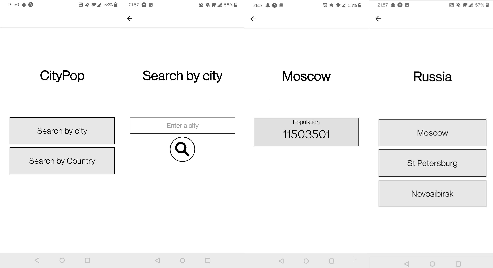

## CityPop - App that displays population count for cities, written in React Native.

### This is an expo project, runnable with "npm start" in the root folder. The app uses the GeoNames api for retrieval of population counts.
---
Below are some pictures of the app while in use

